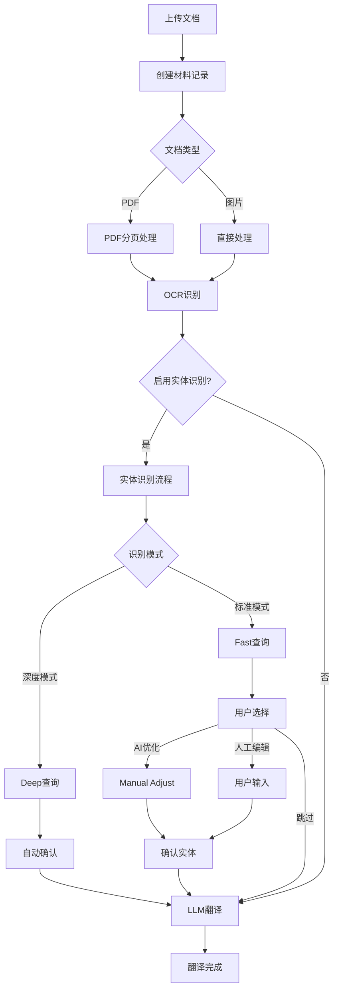

# 文档翻译系统 - 后端API完整手册

## 目录
1. [系统概述](#1-系统概述)
2. [认证机制](#2-认证机制)
3. [核心流程](#3-核心流程)
4. [状态管理](#4-状态管理)
5. [API接口详细说明](#5-api接口详细说明)
6. [WebSocket事件](#6-websocket事件)
7. [错误处理](#7-错误处理)
8. [完整使用示例](#8-完整使用示例)

---

## 1. 系统概述

### 1.1 功能架构
```
用户上传文档 → OCR识别 → [实体识别] → LLM翻译优化 → 导出结果
```

### 1.2 支持的文件类型
- PDF文档（.pdf）
- 图片文件（.jpg, .png, .jpeg, .gif, .bmp）

### 1.3 翻译流程
1. **百度OCR**：识别文档中的文字并进行初步翻译
2. **实体识别**（可选）：识别公司/品牌等实体，获取官方英文名
3. **LLM优化**：使用GPT-5-mini优化翻译质量
4. **AI文本修订**：根据用户指令修改文本格式

---

## 2. 认证机制

### 2.1 用户注册
```http
POST /api/register
Content-Type: application/json

{
    "email": "user@example.com",
    "password": "password123"
}

Response:
{
    "success": true,
    "message": "注册成功"
}
```

### 2.2 用户登录
```http
POST /api/login
Content-Type: application/json

{
    "email": "user@example.com",
    "password": "password123"
}

Response:
{
    "success": true,
    "access_token": "eyJ0eXAiOiJKV1QiLCJhbGc...",
    "user": {
        "id": 1,
        "email": "user@example.com"
    }
}
```

### 2.3 Token刷新
```http
POST /api/refresh
Authorization: Bearer <refresh_token>

Response:
{
    "access_token": "new_access_token"
}
```

### 2.4 使用Token
所有需要认证的API都需要在Header中携带Token：
```http
Authorization: Bearer <access_token>
```

---

## 3. 核心流程

### 3.1 完整翻译流程



### 3.2 PDF处理流程
```
上传PDF → 分割页面 → 逐页OCR → 合并结果 → 翻译优化
```

### 3.3 实体识别流程
```
快速识别(Fast) → 展示结果 → 用户选择:
                              ├─ AI优化(Manual Adjust)
                              ├─ 人工编辑
                              └─ 跳过

深度识别(Deep) → 自动完成 → 直接翻译
```

---

## 4. 状态管理

### 4.1 材料状态（Material Status）

| 状态值 | 说明 | 下一步可能状态 |
|--------|------|----------------|
| `pending` | 待处理 | uploading |
| `uploading` | 上传中 | processing |
| `processing` | 处理中 | completed/failed |
| `completed` | 完成 | - |
| `failed` | 失败 | - |

### 4.2 处理步骤（Processing Step）

| 步骤值 | 说明 | 触发条件 | 下一步 |
|--------|------|---------|--------|
| `uploaded` | 已上传 | 文件上传成功 | splitting/translating |
| `splitting` | 正在分页 | PDF开始分页 | split_completed |
| `split_completed` | 分页完成 | PDF分页成功 | translating |
| `translating` | OCR翻译中 | 开始OCR识别 | translated |
| `translated` | OCR完成 | OCR识别成功 | entity_recognizing/llm_translating |
| `entity_recognizing` | 实体识别中 | 开始实体识别 | entity_pending_confirm |
| `entity_pending_confirm` | 等待确认实体 | 实体识别完成 | entity_confirmed |
| `entity_confirmed` | 实体已确认 | 用户确认实体 | llm_translating |
| `llm_translating` | LLM优化中 | 开始LLM翻译 | llm_translated |
| `llm_translated` | LLM优化完成 | LLM翻译成功 | completed |
| `failed` | 处理失败 | 任何步骤失败 | - |

### 4.3 状态流转示例

#### 场景1：不启用实体识别
```
uploaded → translating → translated → llm_translating → llm_translated
```

#### 场景2：深度实体识别（全自动）
```
uploaded → translating → translated → entity_recognizing → entity_confirmed → llm_translating → llm_translated
```

#### 场景3：标准实体识别（需确认）
```
uploaded → translating → translated → entity_recognizing → entity_pending_confirm → entity_confirmed → llm_translating → llm_translated
```

---

## 5. API接口详细说明

### 5.1 客户端管理

#### 5.1.1 创建客户端
```http
POST /api/clients
Authorization: Bearer <token>
Content-Type: multipart/form-data

{
    "name": "客户端名称",
    "description": "描述信息",
    "file": <文件>
}

Response:
{
    "success": true,
    "client": {
        "id": 1,
        "name": "客户端名称",
        "status": "pending"
    }
}
```

#### 5.1.2 获取客户端列表
```http
GET /api/clients
Authorization: Bearer <token>

Response:
{
    "success": true,
    "clients": [
        {
            "id": 1,
            "name": "客户端名称",
            "status": "completed",
            "created_at": "2024-11-18T10:00:00",
            "material_count": 5
        }
    ]
}
```

### 5.2 材料管理

#### 5.2.1 上传材料（文件）
```http
POST /api/materials
Authorization: Bearer <token>
Content-Type: multipart/form-data

{
    "client_id": 1,
    "file": <文件>,
    "name": "材料名称",
    "description": "描述"
}

Response:
{
    "success": true,
    "material": {
        "id": 1,
        "name": "材料名称",
        "type": "pdf",
        "status": "pending",
        "processing_step": "uploaded"
    }
}
```

#### 5.2.2 获取材料详情
```http
GET /api/materials/{material_id}
Authorization: Bearer <token>

Response:
{
    "success": true,
    "material": {
        "id": 1,
        "name": "材料名称",
        "type": "pdf",
        "status": "completed",
        "processing_step": "llm_translated",
        "processing_progress": 100,
        "page_count": 10,
        "entity_recognition_enabled": false,
        "translation_text_info": {...},
        "llm_optimized_text": "..."
    }
}
```

### 5.3 翻译处理

#### 5.3.1 开始翻译（OCR）
```http
POST /api/materials/{material_id}/translate
Authorization: Bearer <token>
Content-Type: application/json

{
    "source_lang": "zh",  // 可选，默认自动检测
    "target_lang": "en"    // 可选，默认英文
}

Response:
{
    "success": true,
    "message": "翻译已开始",
    "processing_step": "translating"
}
```

#### 5.3.2 获取翻译进度
```http
GET /api/materials/{material_id}/translate/progress
Authorization: Bearer <token>

Response:
{
    "success": true,
    "progress": 75,
    "current_page": 8,
    "total_pages": 10,
    "processing_step": "translating"
}
```

### 5.4 实体识别

#### 5.4.1 启用/禁用实体识别
```http
POST /api/materials/{material_id}/enable-entity-recognition
Authorization: Bearer <token>
Content-Type: application/json

{
    "enabled": true
}

Response:
{
    "success": true,
    "enabled": true
}
```

#### 5.4.2 快速实体识别（Fast模式）
```http
POST /api/materials/{material_id}/entity-recognition/fast
Authorization: Bearer <token>

Response:
{
    "success": true,
    "result": {
        "entities": [
            {
                "chinese_name": "腾讯公司",
                "english_name": null,
                "type": "ORGANIZATION"
            },
            {
                "chinese_name": "微信",
                "english_name": null,
                "type": "PRODUCT"
            }
        ],
        "total_entities": 2,
        "mode": "fast"
    },
    "message": "快速识别完成，您可以选择AI深度查询或人工调整"
}
```

#### 5.4.3 深度实体识别（Deep模式）
```http
POST /api/materials/{material_id}/entity-recognition/deep
Authorization: Bearer <token>

Response:
{
    "success": true,
    "result": {
        "entities": [
            {
                "chinese_name": "腾讯公司",
                "english_name": "Tencent Holdings Limited",
                "source": "https://www.tencent.com/",
                "confidence": "high",
                "type": "ORGANIZATION"
            }
        ],
        "total_entities": 2,
        "mode": "deep"
    },
    "message": "深度识别完成，已自动确认，可直接进行LLM翻译"
}
```

#### 5.4.4 AI优化模式（Manual Adjust）
```http
POST /api/materials/{material_id}/entity-recognition/manual-adjust
Authorization: Bearer <token>
Content-Type: application/json

{
    "fast_results": [
        {
            "chinese_name": "腾讯公司",
            "type": "ORGANIZATION"
        }
    ]
}

Response:
{
    "success": true,
    "result": {
        "entities": [
            {
                "chinese_name": "腾讯公司",
                "english_name": "Tencent Holdings Limited",
                "confidence": "medium",
                "type": "ORGANIZATION"
            }
        ],
        "mode": "manual_adjust"
    }
}
```

#### 5.4.5 确认实体
```http
POST /api/materials/{material_id}/confirm-entities
Authorization: Bearer <token>
Content-Type: application/json

{
    "entities": [...],
    "translationGuidance": {
        "organizations": ["腾讯公司 -> Tencent"],
        "products": ["微信 -> WeChat"]
    }
}

Response:
{
    "success": true,
    "message": "实体已确认",
    "processing_step": "entity_confirmed"
}
```

### 5.5 LLM优化

#### 5.5.1 开始LLM翻译优化
```http
POST /api/materials/{material_id}/llm-translate
Authorization: Bearer <token>

Response (成功):
{
    "success": true,
    "message": "LLM翻译优化已开始",
    "processing_step": "llm_translating"
}

Response (需要先确认实体):
{
    "success": false,
    "error": "请先完成实体识别确认",
    "requireEntityConfirmation": true,
    "processing_step": "entity_pending_confirm"
}
```

#### 5.5.2 获取LLM优化结果
```http
GET /api/materials/{material_id}/llm-result
Authorization: Bearer <token>

Response:
{
    "success": true,
    "optimized_text": "优化后的翻译文本...",
    "regions": [
        {
            "id": 0,
            "original": "百度翻译",
            "optimized": "LLM优化翻译"
        }
    ]
}
```

### 5.6 AI文本修订

#### 5.6.1 AI修订文本
```http
POST /api/ai-revise-text
Authorization: Bearer <token>
Content-Type: application/json

{
    "original_text": "原始文本",
    "instruction": "添加标点符号，保留原文内容"
}

Response:
{
    "success": true,
    "revised_text": "修订后的文本",
    "model_used": "gpt-5-mini"
}
```

### 5.7 导出功能

#### 5.7.1 导出翻译结果（Word）
```http
GET /api/materials/{material_id}/export/word
Authorization: Bearer <token>

Response:
文件下载（.docx格式）
```

#### 5.7.2 导出原始数据（JSON）
```http
GET /api/materials/{material_id}/export/json
Authorization: Bearer <token>

Response:
{
    "material": {...},
    "ocr_result": {...},
    "llm_result": {...},
    "entity_result": {...}
}
```

---

## 6. WebSocket事件

### 6.1 连接WebSocket
```javascript
const socket = io('wss://your-domain.com', {
    auth: {
        token: 'your_jwt_token'
    }
});
```

### 6.2 事件类型

#### 6.2.1 材料状态更新
```javascript
// 监听
socket.on('material_updated', (data) => {
    console.log(data);
    // {
    //     material_id: 1,
    //     status: "processing",
    //     processing_step: "translating",
    //     progress: 50
    // }
});
```

#### 6.2.2 翻译进度
```javascript
socket.on('translation_progress', (data) => {
    // {
    //     material_id: 1,
    //     current_page: 5,
    //     total_pages: 10,
    //     progress: 50
    // }
});
```

#### 6.2.3 错误通知
```javascript
socket.on('processing_error', (data) => {
    // {
    //     material_id: 1,
    //     error: "OCR识别失败",
    //     step: "translating"
    // }
});
```

---

## 7. 错误处理

### 7.1 错误响应格式
```json
{
    "success": false,
    "error": "错误类型",
    "message": "详细错误信息",
    "code": "ERROR_CODE"
}
```

### 7.2 常见错误码

| HTTP状态码 | 错误码 | 说明 | 处理建议 |
|-----------|--------|------|----------|
| 400 | BAD_REQUEST | 请求参数错误 | 检查请求参数 |
| 401 | UNAUTHORIZED | 未认证 | 重新登录 |
| 403 | FORBIDDEN | 无权限 | 检查权限 |
| 404 | NOT_FOUND | 资源不存在 | 检查ID |
| 409 | CONFLICT | 资源冲突 | 等待或重试 |
| 422 | UNPROCESSABLE | 业务逻辑错误 | 查看错误信息 |
| 500 | INTERNAL_ERROR | 服务器错误 | 联系管理员 |
| 503 | SERVICE_UNAVAILABLE | 服务不可用 | 稍后重试 |

### 7.3 特殊错误处理

#### 7.3.1 翻译锁定错误
```json
{
    "success": false,
    "error": "该材料正在翻译中，请等待完成后再试",
    "code": "TRANSLATION_LOCKED",
    "status": "processing"
}
```

#### 7.3.2 实体识别超时
```json
{
    "success": false,
    "error": "实体识别服务暂时不可用",
    "recoverable": true,
    "message": "可以跳过实体识别继续翻译"
}
```

---

## 8. 完整使用示例

### 8.1 完整的翻译流程（JavaScript/Axios）

```javascript
// 1. 登录获取Token
async function login() {
    const response = await axios.post('/api/login', {
        email: 'user@example.com',
        password: 'password123'
    });
    const token = response.data.access_token;
    axios.defaults.headers.common['Authorization'] = `Bearer ${token}`;
    return token;
}

// 2. 创建客户端
async function createClient() {
    const formData = new FormData();
    formData.append('name', '测试客户端');
    formData.append('description', '测试描述');

    const response = await axios.post('/api/clients', formData);
    return response.data.client.id;
}

// 3. 上传材料
async function uploadMaterial(clientId, file) {
    const formData = new FormData();
    formData.append('client_id', clientId);
    formData.append('file', file);
    formData.append('name', file.name);

    const response = await axios.post('/api/materials', formData);
    return response.data.material.id;
}

// 4. 开始OCR翻译
async function startOCR(materialId) {
    const response = await axios.post(`/api/materials/${materialId}/translate`, {
        source_lang: 'zh',
        target_lang: 'en'
    });

    // 等待OCR完成
    await waitForStep(materialId, 'translated');
}

// 5. 实体识别流程（可选）
async function handleEntityRecognition(materialId, mode = 'standard') {
    // 启用实体识别
    await axios.post(`/api/materials/${materialId}/enable-entity-recognition`, {
        enabled: true
    });

    if (mode === 'deep') {
        // 深度模式：全自动
        await axios.post(`/api/materials/${materialId}/entity-recognition/deep`);
    } else {
        // 标准模式：需要用户交互
        // 5.1 快速识别
        const fastResponse = await axios.post(
            `/api/materials/${materialId}/entity-recognition/fast`
        );

        const entities = fastResponse.data.result.entities;

        // 5.2 用户选择处理方式（这里假设选择AI优化）
        const adjustResponse = await axios.post(
            `/api/materials/${materialId}/entity-recognition/manual-adjust`,
            { fast_results: entities }
        );

        // 5.3 确认实体
        await axios.post(`/api/materials/${materialId}/confirm-entities`, {
            entities: adjustResponse.data.result.entities,
            translationGuidance: {
                organizations: entities
                    .filter(e => e.type === 'ORGANIZATION')
                    .map(e => `${e.chinese_name} -> ${e.english_name}`)
            }
        });
    }
}

// 6. LLM翻译优化
async function startLLMTranslation(materialId) {
    const response = await axios.post(`/api/materials/${materialId}/llm-translate`);

    // 等待LLM完成
    await waitForStep(materialId, 'llm_translated');
}

// 7. 导出结果
async function exportResult(materialId) {
    const response = await axios.get(
        `/api/materials/${materialId}/export/word`,
        { responseType: 'blob' }
    );

    // 下载文件
    const url = window.URL.createObjectURL(response.data);
    const a = document.createElement('a');
    a.href = url;
    a.download = 'translation.docx';
    a.click();
}

// 辅助函数：等待特定状态
async function waitForStep(materialId, targetStep, maxWait = 300000) {
    const startTime = Date.now();

    while (Date.now() - startTime < maxWait) {
        const response = await axios.get(`/api/materials/${materialId}`);
        const material = response.data.material;

        if (material.processing_step === targetStep) {
            return material;
        }

        if (material.status === 'failed') {
            throw new Error('Processing failed');
        }

        await new Promise(resolve => setTimeout(resolve, 2000));
    }

    throw new Error('Timeout waiting for ' + targetStep);
}

// 完整流程
async function completeTranslationFlow(file) {
    try {
        // 1. 登录
        await login();

        // 2. 创建客户端
        const clientId = await createClient();

        // 3. 上传材料
        const materialId = await uploadMaterial(clientId, file);

        // 4. OCR翻译
        await startOCR(materialId);

        // 5. 实体识别（可选）
        const useEntityRecognition = confirm('是否启用实体识别？');
        if (useEntityRecognition) {
            const useDeepMode = confirm('使用深度模式（全自动）？');
            await handleEntityRecognition(
                materialId,
                useDeepMode ? 'deep' : 'standard'
            );
        }

        // 6. LLM优化
        await startLLMTranslation(materialId);

        // 7. 导出结果
        await exportResult(materialId);

        alert('翻译完成！');
    } catch (error) {
        console.error('翻译失败:', error);
        alert('翻译失败: ' + error.message);
    }
}
```

### 8.2 WebSocket实时监控示例

```javascript
// 连接WebSocket
const socket = io('wss://your-domain.com', {
    auth: { token: localStorage.getItem('token') }
});

// 监听材料更新
socket.on('material_updated', (data) => {
    updateMaterialStatus(data.material_id, data.status, data.processing_step);
    updateProgressBar(data.material_id, data.progress);
});

// 监听翻译进度
socket.on('translation_progress', (data) => {
    updatePageProgress(
        data.material_id,
        data.current_page,
        data.total_pages
    );
});

// 监听错误
socket.on('processing_error', (data) => {
    showError(data.error);
    markMaterialFailed(data.material_id);
});

// 订阅特定材料的更新
function subscribeMaterial(materialId) {
    socket.emit('subscribe_material', { material_id: materialId });
}

// 取消订阅
function unsubscribeMaterial(materialId) {
    socket.emit('unsubscribe_material', { material_id: materialId });
}
```

---

## 附录A：PDF处理特殊说明

### PDF分页处理
- PDF文件会自动分页处理
- 每页独立进行OCR识别
- 页面结果自动合并
- 支持获取单页翻译结果

### 获取PDF单页翻译
```http
GET /api/materials/{material_id}/pages/{page_number}/translation
Authorization: Bearer <token>

Response:
{
    "success": true,
    "page_number": 1,
    "translation": {...},
    "status": "completed"
}
```

---

## 附录B：批量操作

### 批量上传材料
```http
POST /api/materials/batch
Authorization: Bearer <token>
Content-Type: multipart/form-data

{
    "client_id": 1,
    "files[]": [文件1, 文件2, ...]
}

Response:
{
    "success": true,
    "materials": [
        {"id": 1, "name": "文件1", "status": "pending"},
        {"id": 2, "name": "文件2", "status": "pending"}
    ]
}
```

### 批量开始翻译
```http
POST /api/materials/batch/translate
Authorization: Bearer <token>
Content-Type: application/json

{
    "material_ids": [1, 2, 3],
    "enable_entity_recognition": true,
    "entity_mode": "deep"
}

Response:
{
    "success": true,
    "started": [1, 2, 3],
    "failed": []
}
```

---

## 附录C：配置和限制

### 系统限制
- 单个文件大小限制：100MB
- PDF最大页数：500页
- 并发翻译数：5个
- Token有效期：24小时
- Refresh Token有效期：30天

### 超时设置
- OCR超时：60秒/页
- 实体识别Fast模式：10秒
- 实体识别Deep模式：120秒
- LLM翻译：120秒
- AI文本修订：30秒

---

## 版本历史

| 版本 | 日期 | 更新内容 |
|------|------|----------|
| 1.0 | 2024-11-18 | 初始版本 |
| 1.1 | 2024-11-18 | 添加实体识别功能 |
| 1.2 | 2024-11-18 | 升级到GPT-5-mini |

---

## 联系支持

- 技术支持邮箱：support@example.com
- API状态页面：https://status.example.com
- 开发者文档：https://docs.example.com

---

*本文档最后更新时间：2024-11-18*